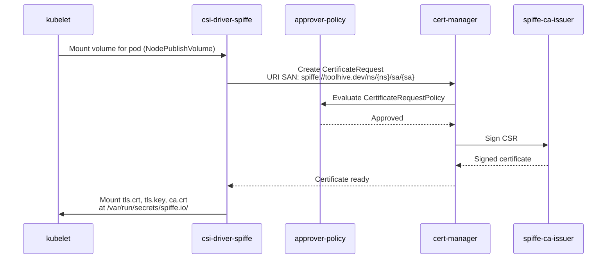
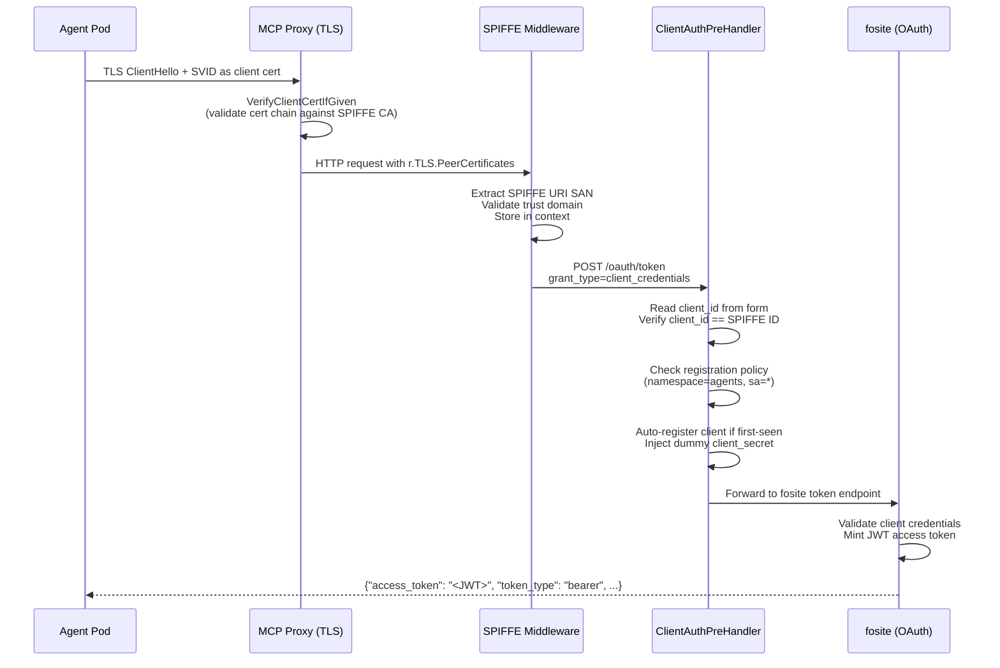
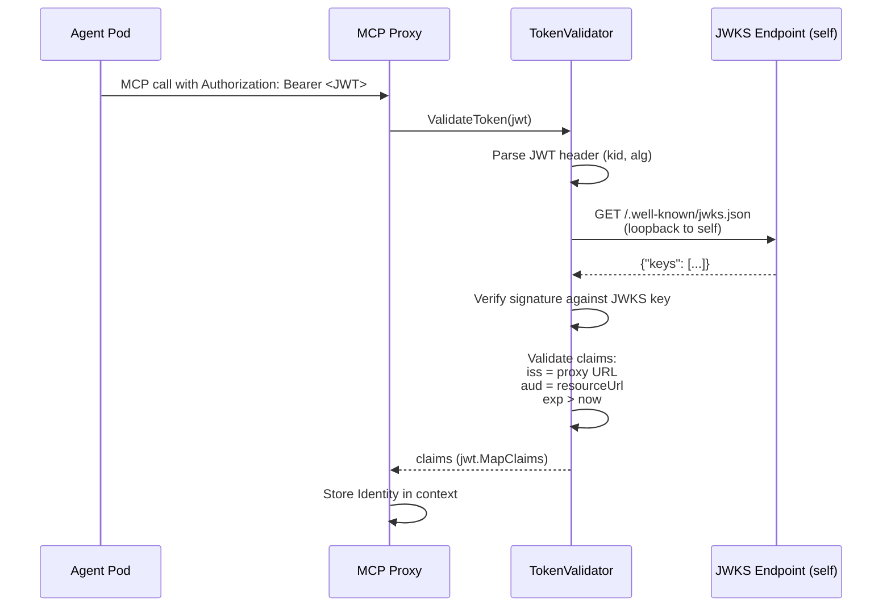
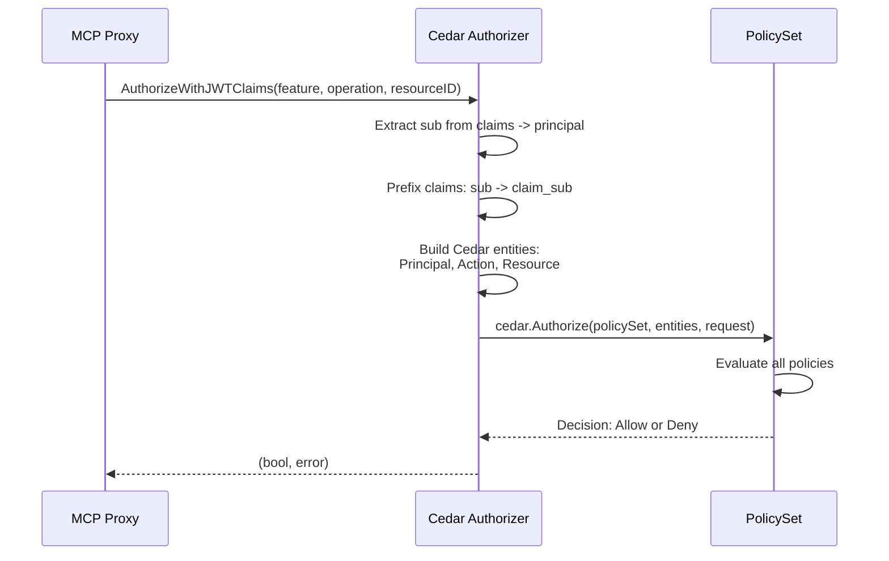

# Cluster Flows Deep Dive

This document follows a request through the SPIFFE PoC cluster, tracing what
happens at each network hop from pod startup to authorized MCP tool call. It
covers the runtime behavior of the deployed system, not the code structure
(see [implementation.md](implementation.md) for that).

**Assumes familiarity with:** Kubernetes pods/services, cert-manager
Certificates and Issuers, X.509 certificates, SPIFFE concepts (trust domain,
SVID, URI SAN), OAuth 2.0 client credentials grant.

**Reference manifests:**
- Infrastructure: `deploy/spiffe-poc/setup.sh` + `deploy/spiffe-poc/manifests/`
- Demo workloads: `deploy/spiffe-poc/demo/manifests/`
- Demo script: `deploy/spiffe-poc/demo/run-demo.sh`

---

## Infrastructure Layer

The cluster runs on kind with the following components:

| Component | Version | Role |
|---|---|---|
| cert-manager | v1.17.1 | X.509 lifecycle (CA, server certs, SVIDs via CSI) |
| approver-policy | v0.18.0 | CertificateRequest approval gate |
| csi-driver-spiffe | v0.9.1 | Mounts auto-rotated SVIDs into pods |

### CA Chain

```
selfsigned-issuer (ClusterIssuer)
  |
  +-- spiffe-root-ca (Certificate, isCA: true, ECDSA P-256, 10yr)
        stored in: spiffe-root-ca-secret (cert-manager namespace)
        |
        +-- spiffe-ca-issuer (ClusterIssuer, type: CA)
              signs: agent SVIDs + MCP proxy server certs
```

Both agent identity certificates and MCP proxy server certificates are signed
by the same CA. This shared root of trust is what makes mTLS possible without
an external CA or service mesh.

### Trust Domain

All SPIFFE IDs use the trust domain `toolhive.dev`. The csi-driver-spiffe
Helm chart is configured with `app.trustDomain=toolhive.dev`, so every SVID
it issues has a URI SAN of the form:

```
spiffe://toolhive.dev/ns/<namespace>/sa/<service-account>
```

### CertificateRequestPolicy

A single policy (`allow-server-certs`) gates all certificate issuance through
`spiffe-ca-issuer`:

```yaml
spec:
  allowed:
    commonName:
      value: "*.svc.cluster.local"
    dnsNames:
      values: ["*.svc.cluster.local", "*.svc", "*"]
    usages:
      - "server auth"
  selector:
    issuerRef:
      name: spiffe-ca-issuer
      kind: ClusterIssuer
      group: cert-manager.io
```

The default cert-manager approver is disabled (`--controllers=*,-certificaterequests-approver`)
so that approver-policy is the sole approval authority.

---

## Flow 1: Identity Provisioning

**Trigger:** A pod spec declares a CSI volume with driver `spiffe.csi.cert-manager.io`.



### What lands in the pod

The CSI driver writes three files into the pod's volume:

| File | Contents |
|---|---|
| `tls.crt` | Leaf certificate with SPIFFE URI SAN (the SVID) |
| `tls.key` | Private key for the SVID |
| `ca.crt` | The SPIFFE root CA certificate (from `sourceCABundle` config) |

The pod manifest requests a 1-hour certificate duration:

```yaml
volumes:
  - name: spiffe-certs
    csi:
      driver: spiffe.csi.cert-manager.io
      readOnly: true
      volumeAttributes:
        spiffe.csi.cert-manager.io/certificate-duration: "1h"
```

The CSI driver automatically rotates the certificate before expiry. The pod
does not need to take any action -- the files are replaced in-place.

### Demo identities

| Pod | Namespace | Service Account | SPIFFE ID |
|---|---|---|---|
| `devops-agent` | `agents` | `devops-agent` | `spiffe://toolhive.dev/ns/agents/sa/devops-agent` |
| `intern-agent` | `agents` | `intern-agent` | `spiffe://toolhive.dev/ns/agents/sa/intern-agent` |
| `rogue-agent` | `untrusted` | `rogue-agent` | `spiffe://toolhive.dev/ns/untrusted/sa/rogue-agent` |

No pod was given a password, API key, or client secret. Identity is derived
entirely from the Kubernetes namespace and service account.

---

## Flow 2: Token Acquisition

An agent wants to call an MCP tool. First, it must obtain a JWT access token
from the MCP proxy's embedded authorization server.



### Step 1: TLS Handshake

The MCP proxy listens on HTTPS with a cert-manager-issued server certificate.
The TLS config uses `tls.VerifyClientCertIfGiven`, which means:

- If the client presents a certificate, it is validated against the CA pool
  (the SPIFFE root CA loaded from `clientCASecretRef`).
- If no certificate is presented (e.g., a browser OIDC flow), the handshake
  still succeeds.

Both the agent's SVID and the proxy's server cert are signed by the same
`spiffe-ca-issuer`, so mutual verification works without any external trust
configuration.

### Step 2: SPIFFE Middleware Extraction

The middleware at `pkg/authserver/spiffe/middleware.go` runs on every request:

1. **No TLS or no client cert?** Pass through (browser OIDC flow).
2. **Extract URI SANs** from `r.TLS.PeerCertificates[0].URIs`, filtering for
   the `spiffe://` scheme.
3. **Validate exactly one SPIFFE URI** -- the X.509-SVID spec requires it.
4. **Parse the SPIFFE ID** using `go-spiffe/v2/spiffeid.FromURI()`.
5. **Check trust domain** matches `toolhive.dev`.
6. **Defense-in-depth:** reject paths containing `..` traversal segments.
7. **Store** the validated `spiffeid.ID` in the request context.

All error responses use OAuth 2.0 JSON format (`{"error": "invalid_client",
"error_description": "..."}`) with HTTP 401.

### Step 3: Client Credentials Grant

The `ClientAuthPreHandler` at `pkg/authserver/spiffe/client_auth.go` wraps
the fosite token endpoint:

1. Read `client_id` from the POST body. If absent, default to the SPIFFE ID.
2. **Verify** that `client_id` matches the SPIFFE ID extracted from the cert.
   This follows `draft-ietf-oauth-spiffe-client-auth`.
3. **Check registration policy** (`pkg/authserver/spiffe/policy.go`):
   - Parse the SPIFFE ID path (`/ns/<ns>/sa/<sa>`) to extract namespace and
     service account.
   - Match against `allowedIdentities` in the MCPExternalAuthConfig (e.g.,
     `namespace: agents, serviceAccount: *`).
   - Check the `maxRegistrations` counter (atomic, optimistic increment with
     rollback).
4. **Auto-register** the client in fosite's in-memory storage if not already
   known. Handles TOCTOU races via `ErrAlreadyExists`.
5. **Inject a dummy client_secret** into both `r.Form` and `r.PostForm`. This
   is a PoC workaround: fosite requires a secret for confidential clients, but
   the real authentication already happened at the TLS layer.

### Step 4: JWT Issuance

fosite processes the `client_credentials` grant and mints a JWT with:

| Claim | Value | Source |
|---|---|---|
| `sub` | `spiffe://toolhive.dev/ns/agents/sa/devops-agent` | SPIFFE ID from the client cert |
| `iss` | `https://mcp-fetch-proxy.toolhive-system.svc.cluster.local:8080` | Embedded AS issuer config |
| `aud` | `https://mcp-fetch-proxy.toolhive-system.svc.cluster.local:8080` | `resourceUrl` from MCPServer spec |
| `exp` | (current time + token lifetime) | fosite default |

The `sub` claim carrying the SPIFFE ID is what Cedar policies evaluate downstream.

### Actual curl Command (from the demo script)

```bash
kubectl exec -n agents devops-agent -- \
  curl -sk --max-time 10 \
    --cert /var/run/secrets/spiffe.io/tls.crt \
    --key  /var/run/secrets/spiffe.io/tls.key \
    --cacert /var/run/secrets/spiffe.io/ca.crt \
    -X POST \
    -H "Content-Type: application/x-www-form-urlencoded" \
    -d "grant_type=client_credentials&client_id=spiffe://toolhive.dev/ns/agents/sa/devops-agent&resource=https://mcp-fetch-proxy.toolhive-system.svc.cluster.local:8080" \
    https://mcp-fetch-proxy.toolhive-system.svc.cluster.local:8080/oauth/token
```

Decoded JWT payload (representative):

```json
{
  "sub": "spiffe://toolhive.dev/ns/agents/sa/devops-agent",
  "iss": "https://mcp-fetch-proxy.toolhive-system.svc.cluster.local:8080",
  "aud": "https://mcp-fetch-proxy.toolhive-system.svc.cluster.local:8080",
  "exp": 1742947200
}
```

---

## Flow 3: Token Validation

When the agent uses its JWT to call an MCP tool, the proxy's OIDC middleware
validates the token before the request reaches the MCP server.



### Self-referencing OIDC

The embedded auth server and the OIDC validation middleware run in the same
process. The proxy is both the token issuer and the token validator:

- **Issuer URL** = proxy's service URL (e.g.,
  `https://mcp-fetch-proxy.toolhive-system.svc.cluster.local:8080`)
- **JWKS URL** = `<issuer>/.well-known/jwks.json`, served by the same process

This self-referencing pattern requires two MCPServer config flags:

```yaml
oidcConfig:
  inline:
    jwksAllowPrivateIP: true     # proxy connects to itself on cluster IP
    insecureAllowHTTP: false     # still enforce HTTPS
    caBundleRef:                 # trust the SPIFFE CA for the loopback TLS
      configMapRef:
        name: spiffe-ca-bundle
        key: ca.crt
```

### Audience Check

The token's `aud` claim must match the `resourceUrl` field on the MCPServer.
Both are set to the proxy's service URL. The `resource` parameter in the token
request (per RFC 8707) tells the auth server which audience to stamp on the JWT.

If a token issued for the fetch proxy is presented to the cluster-tools proxy,
the audience check fails and the request is rejected.

---

## Flow 4: Authorization (Cedar Policy Evaluation)

After token validation, Cedar policies decide whether the request is permitted.



### How Claims Map to Cedar Entities

The JWT `sub` claim (the SPIFFE ID) becomes the principal's `claim_sub`
attribute. The `preprocessClaims()` function adds a `claim_` prefix to all
JWT claims before they become entity attributes.

Cedar request structure:

| Cedar Field | Value | Example |
|---|---|---|
| `principal` | `Client::"<sub>"` | `Client::"spiffe://toolhive.dev/ns/agents/sa/devops-agent"` |
| `action` | `Action::"<operation>"` | `Action::"call_tool"` |
| `resource` | `Tool::"<tool-name>"` | `Tool::"fetch_url"` |

### Fetch Proxy Cedar Policies

```cedar
// devops-agent: full access to all tools
permit(
  principal,
  action == Action::"call_tool",
  resource
)
when {
  principal.claim_sub like "spiffe://toolhive.dev/ns/agents/sa/devops-*"
};

// intern-agent: restricted to fetch_url only
permit(
  principal,
  action == Action::"call_tool",
  resource == Tool::"fetch_url"
)
when {
  principal.claim_sub like "spiffe://toolhive.dev/ns/agents/sa/intern-*"
};

// agents namespace: all principals may list tools
permit(
  principal,
  action == Action::"list_tools",
  resource
)
when {
  principal.claim_sub like "spiffe://toolhive.dev/ns/agents/*"
};
```

### Cluster-Tools Proxy Cedar Policies

```cedar
// Only devops-agent may call any cluster tool
permit(
  principal,
  action == Action::"call_tool",
  resource
)
when {
  principal.claim_sub like "spiffe://toolhive.dev/ns/agents/sa/devops-*"
};

// agents namespace: all principals may list tools (read-only discovery)
permit(
  principal,
  action == Action::"list_tools",
  resource
)
when {
  principal.claim_sub like "spiffe://toolhive.dev/ns/agents/*"
};

// intern-agent: implicit DENY on call_tool (no permit rule matches)
```

The Cedar `like` operator supports `*` as a wildcard suffix. SPIFFE IDs
follow a predictable path structure, making pattern matching natural.

---

## The 3x2 Authorization Matrix

### Token Acquisition Results

| Agent | Namespace | fetch proxy | cluster-tools proxy |
|---|---|---|---|
| devops-agent | agents | TOKEN GRANTED | TOKEN GRANTED |
| intern-agent | agents | TOKEN GRANTED | TOKEN GRANTED |
| rogue-agent | untrusted | TOKEN DENIED | TOKEN DENIED |

rogue-agent is rejected at the registration policy layer. Its SPIFFE ID path
contains `ns/untrusted`, which does not match the policy's `namespace: agents`.
The error response:

```json
{
  "error": "access_denied",
  "error_description": "SPIFFE ID is not authorized to register as a client"
}
```

### MCP Call Results

| Agent | Server | list_tools | call_tool (any) | call_tool (fetch_url) |
|---|---|---|---|---|
| **devops-agent** | fetch | ALLOW | ALLOW | ALLOW |
| **devops-agent** | cluster-tools | ALLOW | ALLOW | n/a |
| **intern-agent** | fetch | ALLOW | DENY | ALLOW |
| **intern-agent** | cluster-tools | ALLOW | DENY | DENY |
| **rogue-agent** | fetch | DENY (no token) | DENY (no token) | DENY (no token) |
| **rogue-agent** | cluster-tools | DENY (no token) | DENY (no token) | DENY (no token) |

### Walking Through Each Outcome

**devops-agent -> fetch (call_tool):** Token granted (namespace matches).
Cedar policy matches `devops-*` on `call_tool` with any resource. ALLOW.

**intern-agent -> fetch (call_tool fetch_url):** Token granted. Cedar
policy matches `intern-*` on `call_tool` with `resource == Tool::"fetch_url"`.
ALLOW.

**intern-agent -> fetch (call_tool other):** Token granted. No Cedar permit
rule matches `intern-*` on `call_tool` with a resource other than `fetch_url`.
Implicit DENY (Cedar's default-deny semantics).

**intern-agent -> cluster-tools (call_tool):** Token granted. The
cluster-tools policy only permits `call_tool` for `devops-*`. No matching
permit for `intern-*`. Implicit DENY.

**rogue-agent -> any proxy:** The TLS handshake succeeds (the SVID is signed
by the same CA). The SPIFFE middleware extracts the SPIFFE ID. But
`ClientAuthPreHandler` rejects the registration because `ns/untrusted` does
not match `namespace: agents`. HTTP 403 returned. The agent never receives a
JWT, so it cannot make any MCP calls.

---

## Registration Policy Enforcement

The registration policy is configured per-proxy in the MCPExternalAuthConfig:

```yaml
spiffeClientPolicy:
  allowedIdentities:
    - namespace: agents
      serviceAccount: "*"
  maxRegistrations: 50
```

### Namespace Matching

The `parseKubernetesPath()` function splits the SPIFFE ID path on `/`:

```
/ns/agents/sa/devops-agent
 ^   ^      ^   ^
 |   |      |   +-- serviceAccount
 |   |      +------ "sa" marker
 |   +------------- namespace
 +----------------- "ns" marker
```

Matching rules:
- `namespace: agents` matches only pods in the `agents` namespace.
- `serviceAccount: "*"` matches any service account name.
- Multiple `allowedIdentities` entries are OR-ed: if any entry matches, the
  identity is allowed.

### MaxRegistrations

The `maxRegistrations` field caps the total number of auto-registered clients.
The counter uses an atomic integer with optimistic increment:

1. `IncrementRegistrations()` adds 1 atomically.
2. If the new count exceeds `maxRegistrations`, it decrements and rejects.
3. On TOCTOU race (`ErrAlreadyExists` from storage), the counter is rolled
   back via `DecrementRegistrations()`.

This is defense-in-depth. The in-memory fosite storage is cleared on pod
restart, so the counter resets naturally. In production, persistent storage
would make this counter load-bearing.

---

## Deny Paths

### Deny Path 1: Wrong Trust Domain

An SVID from a different trust domain (e.g., `spiffe://evil.corp/ns/agents/sa/hacker`)
is rejected by the SPIFFE middleware:

```json
{
  "error": "invalid_client",
  "error_description": "SPIFFE ID trust domain does not match expected trust domain"
}
```

HTTP 401. The request never reaches the token endpoint.

### Deny Path 2: Wrong Namespace (Registration Policy)

rogue-agent's SPIFFE ID `spiffe://toolhive.dev/ns/untrusted/sa/rogue-agent`
passes trust domain validation but fails the registration policy:

```json
{
  "error": "access_denied",
  "error_description": "SPIFFE ID is not authorized to register as a client"
}
```

HTTP 403. No JWT is issued.

### Deny Path 3: Client ID Mismatch

If an agent presents a client_id that does not match its SVID (e.g., tries to
impersonate another agent), the pre-handler rejects it:

```json
{
  "error": "invalid_client",
  "error_description": "client_id does not match the SPIFFE ID in the client certificate"
}
```

HTTP 401. The mTLS certificate is the source of truth, not the form parameter.

### Deny Path 4: Cedar Implicit Deny

intern-agent requesting `call_tool` on cluster-tools: the token is valid, but
no Cedar permit rule matches the combination of `principal.claim_sub` and the
action. Cedar's default-deny semantics mean the request is forbidden.

### Deny Path 5: Wrong Audience

A JWT issued by the fetch proxy (`aud: https://mcp-fetch-proxy...`) is
presented to the cluster-tools proxy. The `TokenValidator.validateClaims()`
audience check fails because the token's audience does not match the
cluster-tools proxy's `resourceUrl`. The request is rejected before Cedar
evaluation.

---

## PoC Shortcuts and Production Considerations

| PoC Shortcut | Production Alternative |
|---|---|
| Broad ClusterRoleBinding for CertificateRequest creation (all ServiceAccounts) | Namespace-scoped RoleBindings per tenant |
| Single CertificateRequestPolicy for all cert types | Separate policies for server certs vs SVIDs |
| Self-signed root CA | HSM-backed CA or Vault PKI |
| Static CA bundle ConfigMap (manually copied) | trust-manager for automatic CA distribution |
| Per-TLS-handshake cert reload from disk | Cached cert with periodic filesystem watch |
| CA pool loaded once at startup | Watch for CA rotation events |
| In-memory fosite storage (cleared on restart) | Redis or database-backed storage |
| Dummy client_secret injected for fosite | Custom `fosite.ClientAuthenticationStrategy` that recognizes mTLS clients |
| `runAsUser: 0` on agent pods | Non-root with appropriate file permissions |
